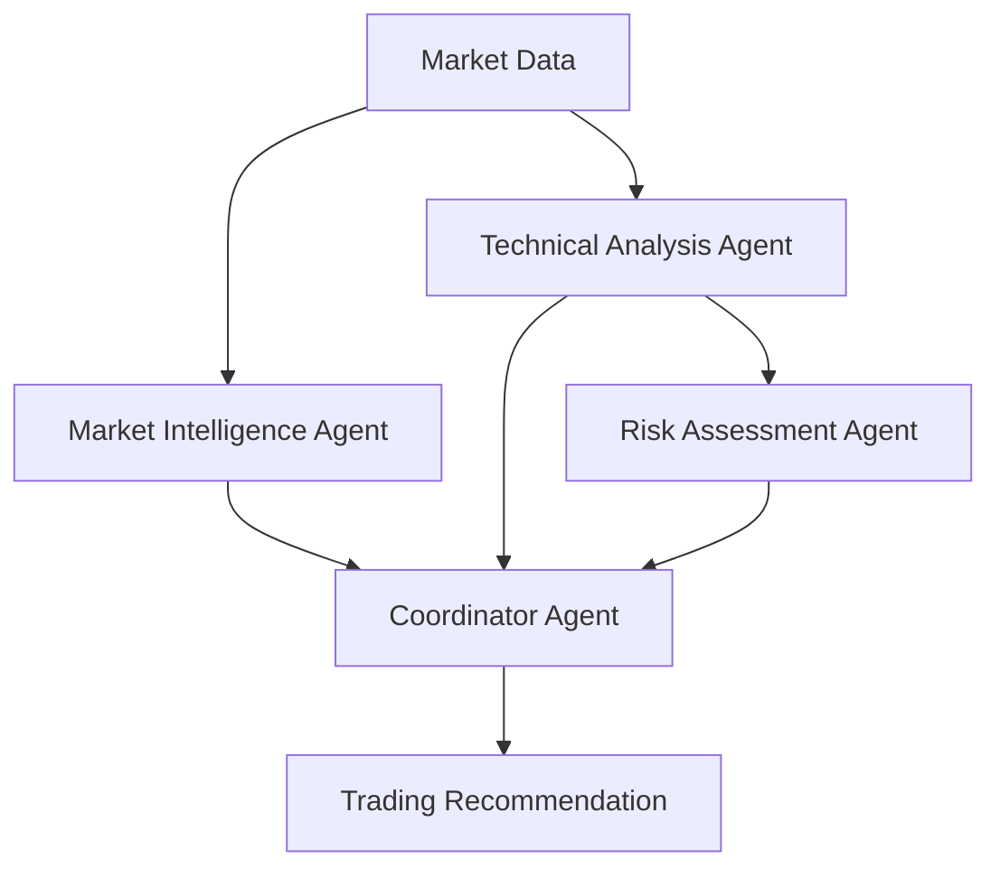

# AI-Powered Forex Trading Strategy

A sophisticated multi-agent AI trading system for forex markets, combining traditional technical analysis with advanced LLM-based decision making using pydantic_ai and OpenAI's GPT models.

## ⚠️ Important Disclaimer

**This software is for educational and research purposes only.**

- Trading forex involves substantial risk of loss
- Past performance does not guarantee future results
- 90% of retail forex traders lose money
- **DO NOT trade real money** without extensive backtesting and paper trading validation
- The authors assume no liability for trading losses

**Current Status**: ⚠️ **Development/Testing** - Not production-ready for live trading.

---

## 🎯 Project Overview

This project implements a **multi-agent AI trading system** that analyzes forex markets using:

1. **Market Intelligence Agent** (o3-mini) - Analyzes news, sentiment, and economic events
2. **Technical Analysis Agent** (gpt-4o) - Evaluates chart patterns and indicators
3. **Risk Assessment Agent** (o3-mini) - Manages position sizing and portfolio risk
4. **Coordinator Agent** (o3-mini) - Synthesizes inputs and makes final decisions

The system integrates with:
- **OANDA v20 API** for trade execution and market data
- **Alpha Vantage** for real-time news and sentiment analysis
- **OpenAI GPT models** (o3-mini + gpt-4o) for intelligent analysis

---

## 📁 Project Structure

```
scalping-strategy/
├── README.md                      # This file
├── scalping_strategy.py          # Base trading strategy (needs fixes)
├── trading_agents_fixed.py       # Production-ready multi-agent system ✅
├── config.example.ini            # Configuration template
├── CLAUDE.md                     # Project development guidelines
├── docs/
│   ├── EXECUTIVE_SUMMARY.md     # Strategic overview and action plan
│   ├── CRITICAL_ANALYSIS.md     # Detailed technical analysis
│   └── FIXES_IMPLEMENTED.md     # What was fixed and what remains
├── pyproject.toml               # Project configuration (uv)
└── uv.lock                      # Dependency lock file
```

---

## 🚀 Quick Start

### Prerequisites

- Python 3.10+
- [uv](https://github.com/astral-sh/uv) package manager
- OANDA account (practice or live)
- OpenAI API key
- Alpha Vantage API key (free tier available)

### Installation

1. **Clone the repository**
   ```bash
   git clone <repository-url>
   cd scalping-strategy
   ```

2. **Install dependencies**
   ```bash
   uv sync
   ```

3. **Configure API credentials**
   ```bash
   cp config.example.ini v20.conf
   # Edit v20.conf with your credentials
   ```

4. **Set environment variables**
   ```bash
   export OPENAI_API_KEY="sk-..."
   export ALPHA_VANTAGE_API_KEY="your_key"
   ```

### Get API Keys

- **OANDA**: Sign up at [OANDA fxTrade Practice](https://www.oanda.com/demo-account/tpa/personal_new)
- **OpenAI**: Get key at [OpenAI API Keys](https://platform.openai.com/api-keys)
- **Alpha Vantage**: Free key at [Alpha Vantage Support](https://www.alphavantage.co/support/#api-key)

---

## 💻 Usage

### Test the AI Agent System

```python
import asyncio
from trading_agents_fixed import get_trading_signal

async def test_agents():
    recommendation = await get_trading_signal(
        instrument="EUR_USD",
        account_balance=10000.0,
        active_positions=[],
        price_data={
            "current_price": 1.0850,
            "timeframes": {
                "5m": [...],  # Add multi-timeframe data
                "1h": [...]
            }
        },
        technical_indicators={
            "rsi": 45.5,
            "atr": 0.0012,
            "ma_short": 1.0855,
            "ma_long": 1.0840
        }
    )

    print(f"Recommendation: {recommendation.action}")
    print(f"Confidence: {recommendation.overall_confidence:.2%}")
    print(f"Reasoning: {recommendation.reasoning}")

asyncio.run(test_agents())
```

### Run Base Trading Strategy

```bash
# Practice environment (recommended)
uv run scalping_strategy.py --env practice

# With custom parameters
uv run scalping_strategy.py \
  --config v20.conf \
  --env practice \
  --interval 300 \
  --max-trades 3 \
  --runtime 3600
```

**Note**: The base strategy (`scalping_strategy.py`) has known issues documented in `docs/CRITICAL_ANALYSIS.md`. Use for reference only until fixes are applied.

### Run News-Aware Strategy (Phase 3) ✅ NEW

The news-aware strategy blocks trades during high-impact economic events to avoid volatility spikes:

```bash
# Set up Trading Economics API key (free tier available)
export TRADING_ECONOMICS_API_KEY="your_key_here"

# Run with news filtering enabled
uv run news_aware_strategy.py --env practice

# Custom buffer times (default: 30min before, 60min after)
uv run news_aware_strategy.py \
  --env practice \
  --buffer-before 45 \
  --buffer-after 90 \
  --interval 300 \
  --max-trades 3

# Check what events are being filtered
tail -f news_aware_strategy.log
```

**Get Trading Economics API Key**: [https://tradingeconomics.com/analytics/api/](https://tradingeconomics.com/analytics/api/) (Free tier: 1,000 requests/month)

**Features**:
- 📅 Fetches upcoming economic events (NFP, FOMC, GDP, CPI, etc.)
- 🛡️ Blocks trades 30min before / 60min after high-impact news
- ⚡ Auto-refreshes calendar every hour
- 📊 Logs critical events at startup
- ✅ Graceful fallback if API unavailable

**Why This Matters**: A single high-impact news event (e.g., Non-Farm Payrolls) can cause 100+ pip moves in seconds with 5-10x normal spreads. Avoiding just 2-3 bad news trades per month can improve returns by 3-5%.

### Run Journaled Strategy (Phase 3) ✅ NEW

Automatic trade journaling with comprehensive performance analytics:

```bash
# Run strategy with automatic journaling
uv run journaled_strategy.py --env practice

# Custom journal database
uv run journaled_strategy.py --env practice --journal-db my_trades.db

# View performance analytics
uv run journal_analytics.py

# Compare time periods
uv run journal_analytics.py --compare --patterns

# Export to CSV
uv run journal_analytics.py --export trades.csv --days 90

# Test journaling system
uv run test_trade_journal.py
```

**Features**:
- 📝 Logs every trade entry and exit automatically
- 📊 Tracks indicators, market context, agent decisions
- 📈 Performance analytics by session, instrument, confidence
- 🎯 Identifies winning/losing patterns
- 💾 SQLite backend (no external dependencies)
- 📤 Export to CSV for Excel analysis

**Analytics Included**:
- Win rate, profit factor, Sharpe ratio
- Average win/loss, expectancy per trade
- Max drawdown, consecutive wins/losses
- Performance by session (Asian, London, NY, Overlap)
- Performance by instrument (EUR_USD, GBP_USD, etc.)
- AI confidence correlation analysis
- Cost breakdown (spread, slippage)

**Why This Matters**: "What gets measured gets managed." Trade journaling is the foundation for systematic improvement. Identify what's working, what's not, and optimize over time.

---

## 🏗️ Architecture

### Multi-Agent Decision Flow



### Agent Responsibilities

| Agent | Model | Role | Weight |
|-------|-------|------|--------|
| **Market Intelligence** | o3-mini | News, sentiment, economic events | 30% |
| **Technical Analysis** | gpt-4o | Chart patterns, indicators | 40% |
| **Risk Assessment** | o3-mini | Position sizing, exposure limits | 30% |
| **Coordinator** | o3-mini | Final decision synthesis | - |

### Decision Criteria

A trade is recommended only when:
- ✅ Overall confidence > 60%
- ✅ At least 2 agents agree on direction
- ✅ Risk assessment approves
- ✅ No critical warnings
- ✅ Clear edge exists (technical + fundamental confluence)

---

## ⚙️ Configuration

### v20.conf Structure

```ini
[practice]
hostname = api-fxpractice.oanda.com
token = YOUR_PRACTICE_OANDA_TOKEN
account_id = YOUR_PRACTICE_ACCOUNT_ID

[live]
hostname = api-fxtrade.oanda.com
token = YOUR_LIVE_OANDA_TOKEN
account_id = YOUR_LIVE_ACCOUNT_ID

[openai]
api_key = YOUR_OPENAI_API_KEY
model = gpt-4o
min_confidence = 0.6
```

**Security**: Never commit `v20.conf` to version control (it's in `.gitignore`).

### Environment Variables (Alternative)

```bash
export OPENAI_API_KEY="sk-..."
export ALPHA_VANTAGE_API_KEY="your_key"
export OANDA_TOKEN="your_token"
export OANDA_ACCOUNT_ID="your_account_id"
```

---

## 📊 Current Status & Roadmap

### ✅ Completed (Phase 1)

- [x] Multi-agent AI system with pydantic_ai
- [x] Correct API usage (output_type, deps, proper run methods)
- [x] Optimal model selection (o3-mini + gpt-4o)
- [x] Real Alpha Vantage news integration
- [x] Comprehensive error handling and fallbacks
- [x] Production-ready agent architecture

### ⚠️ In Progress (Phase 2)

Critical fixes needed before live trading:

- [ ] Multi-timeframe data fetching (agents expect but don't receive)
- [ ] Transaction cost modeling (spread, slippage, swap)
- [ ] Backtesting framework with historical validation
- [ ] Bid/ask pricing (currently uses midpoint)
- [ ] Pip value calculation fixes
- [ ] Leverage limits (cap at 10:1, not broker max)

### 🚧 In Progress (Phase 3)

Advanced intelligence features:

- [x] Economic calendar integration (Trading Economics API) ✅
- [x] Trade journaling and performance tracking ✅
- [ ] Social sentiment analysis (Twitter, Reddit, StockTwits)
- [ ] Parameter optimization framework
- [ ] Session filtering (avoid low-volume hours)
- [ ] Correlation matrix (prevent over-exposure)

See `docs/PHASE_3_IMPLEMENTATION_PLAN.md` for detailed Phase 3 plan.

---

## 📈 Performance Expectations

### Realistic Targets (After Full Validation)

**Swing Trading Approach (4H timeframe)** - Recommended
- Annual Return: 10-20%
- Win Rate: 50-55%
- Sharpe Ratio: 1.2-1.8
- Max Drawdown: 12-18%
- Trades/Month: 10-15

**Scalping Approach (5m timeframe)** - Not Recommended
- High transaction costs (60% of gross profit)
- Requires 60%+ win rate to be profitable
- Difficult for retail traders
- See analysis in `docs/CRITICAL_ANALYSIS.md`

### Why Most Retail Traders Lose

- **Transaction Costs**: 3-4 pips per trade (spread + slippage)
- **Latency**: 100-500ms API delay vs HFT microseconds
- **Spreads**: Retail pays 2-3 pips vs institutions 0.1-0.5 pips
- **Information Asymmetry**: Institutions have better data
- **Psychology**: Emotional decisions override system rules

**Success Probability**: 30-40% (realistic for systematic retail forex trading)

---

## 🧪 Testing & Validation

### Required Before Live Trading

1. **Backtesting** (Minimum 2 years historical data)
   - Sharpe ratio > 1.0
   - Max drawdown < 20%
   - Win rate > 50%
   - Profitable across different market regimes

2. **Paper Trading** (Minimum 90 days)
   - Results match backtest expectations
   - Transaction costs align with model
   - System handles errors gracefully
   - No manual intervention needed

3. **Initial Live Trading** (If validated)
   - Start with 0.25% risk per trade
   - Monitor closely for 30 days
   - Compare to paper trading results
   - Scale gradually if successful

### Current Validation Status

⚠️ **Not validated** - Backtesting framework not yet implemented.

**DO NOT TRADE REAL MONEY** until:
- Phase 2 fixes complete
- Backtest shows 18+ months profitability
- 90 days paper trading validates backtest
- You understand and accept the risks

---

## 💰 Cost Analysis

### Development Costs

| Item | Cost |
|------|------|
| OANDA Practice Account | Free |
| OpenAI API (testing) | $10-20/day |
| OpenAI API (live) | $30-60/day |
| Alpha Vantage API | Free (25 requests/day) |
| Historical Data | Free (OANDA provides) |
| Development Time | 50-70 hours |

### Trading Costs (Per $10k Account, Annual)

| Cost Type | Amount |
|-----------|--------|
| Spread | $600-900 |
| Slippage | $150-300 |
| Swap/Rollover | ~$50 |
| **Total** | **$800-1,250** |

**Implication**: Need >12% gross return to be profitable after costs.

---

## 📚 Documentation

### Key Documents

- **README.md** (this file) - Quick start and overview
- **docs/EXECUTIVE_SUMMARY.md** - Strategic overview and recommendations
- **docs/CRITICAL_ANALYSIS.md** - Detailed technical analysis of all issues
- **docs/FIXES_IMPLEMENTED.md** - What was fixed and what remains
- **CLAUDE.md** - Development guidelines and project instructions

### Reading Order

1. Start with `README.md` (overview)
2. Read `docs/EXECUTIVE_SUMMARY.md` (strategy and roadmap)
3. Review `docs/CRITICAL_ANALYSIS.md` (understand all issues)
4. Check `docs/FIXES_IMPLEMENTED.md` (technical details)

---

## 🔧 Development

### Tech Stack

- **Language**: Python 3.10+
- **Package Manager**: uv
- **AI Framework**: pydantic_ai 1.12.0+
- **LLM Provider**: OpenAI (o3-mini, gpt-4o)
- **Broker API**: OANDA v20
- **News API**: Alpha Vantage
- **Data Analysis**: pandas, numpy
- **HTTP Client**: httpx (async)

### Dependencies

```toml
[dependencies]
pydantic-ai = "^1.12.0"
openai = "^2.7.1"
pandas = "^2.3.3"
numpy = "^2.3.4"
requests = "^2.32.5"
v20 = "^3.0.25.0"
python-dateutil = "^2.9.0"
httpx = "^0.28.1"
```

Install with:
```bash
uv sync
```

### Code Quality

Format code:
```bash
uv run ruff format .
```

Lint code:
```bash
uv run ruff check .
```

---

## 🤝 Contributing

This is currently a private/personal project. If you want to contribute:

1. Read all documentation thoroughly
2. Understand the risks and current limitations
3. Follow the coding standards in `CLAUDE.md`
4. Test thoroughly before submitting changes
5. Never commit API credentials or trading logs

---

## 📄 License

[Add your license here]

---

## ⚖️ Legal & Risk Warnings

### Trading Risks

- **Capital Loss**: You can lose all your invested capital
- **Leverage Risk**: Forex trading typically uses leverage which amplifies losses
- **Market Risk**: Forex markets are volatile and unpredictable
- **Technology Risk**: Software bugs, API failures, network issues can cause losses
- **Regulatory Risk**: Forex trading regulations vary by jurisdiction

### Software Disclaimer

This software is provided "as is" without warranty of any kind. The authors and contributors:

- Make no guarantees of profitability
- Are not responsible for trading losses
- Do not provide financial advice
- Recommend consulting a licensed financial advisor
- Suggest thorough testing before any live trading

### Compliance

- Ensure forex trading is legal in your jurisdiction
- Comply with all local financial regulations
- Report trading income as required by tax laws
- Use appropriate risk disclosure with any clients
- Maintain proper records for regulatory compliance

---

## 📞 Support & Questions

### Getting Help

1. Check the documentation in `docs/`
2. Review the code comments in `trading_agents_fixed.py`
3. Read the critical analysis in `docs/CRITICAL_ANALYSIS.md`
4. Understand this is a research project, not production software

### Known Issues

See `docs/CRITICAL_ANALYSIS.md` for comprehensive list of:
- Critical bugs fixed
- Remaining issues to address
- Performance limitations
- Architectural decisions

---

## 🎯 Bottom Line

**What This Project Is**:
- Research and educational tool for algorithmic trading
- Demonstration of multi-agent AI systems with pydantic_ai
- Framework for systematic forex analysis
- Starting point for further development

**What This Project Is NOT**:
- Production-ready trading software
- Guaranteed profitable strategy
- Financial advice or recommendations
- Fully tested and validated system

**Next Steps**:
1. Read `docs/EXECUTIVE_SUMMARY.md`
2. Understand the risks thoroughly
3. Complete Phase 2 fixes if interested
4. Backtest extensively before any trading
5. Paper trade for 90+ days minimum
6. Never risk money you can't afford to lose

---

**Last Updated**: November 2025
**Version**: 2.0 (Post-Critical Review)
**Status**: Development/Research

*Trade responsibly. Most retail forex traders lose money.*
